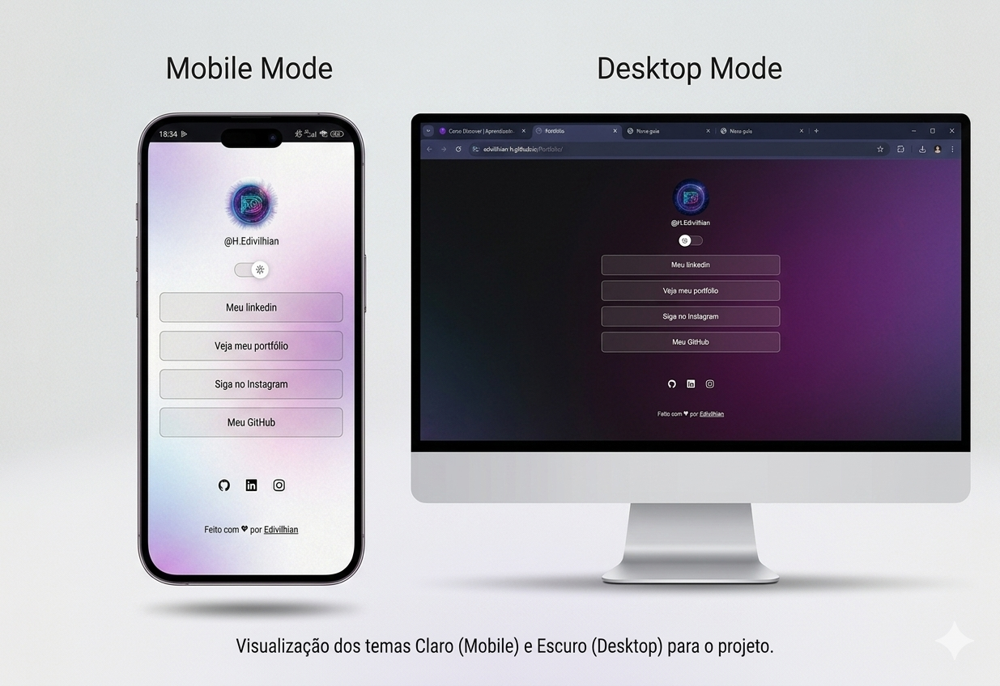

<h1 align="center"> Agregador de links</h1>

  <a href="#-tecnologias">Tecnologias</a>&nbsp;&nbsp;&nbsp;|&nbsp;&nbsp;&nbsp;
  <a href="#-projeto">Projeto</a>&nbsp;&nbsp;&nbsp;|&nbsp;&nbsp;&nbsp;
  <a href="#-layout">Layout</a>&nbsp;&nbsp;&nbsp;|&nbsp;&nbsp;&nbsp;
  <a href="#memo-licença">Licença</a>

  

 

## 🚀 Tecnologias

Esse projeto foi desenvolvido com as seguintes tecnologias:

- HTML e CSS
- JavaScript
- Git e Github

## 💻 Projeto

Este projeto é um agregador de links personalizado (estilo Linktree), desenvolvido para centralizar minha presença digital em um único lugar. Ele permite que usuários acessem rapidamente meu portfólio, redes sociais e currículo de forma organizada e visualmente atraente.

## 🔖 Layout

Você pode visualizar o projeto através [DESSE LINK](https://edivilhian-h.github.io/Portfolio/).

## :memo: Licença

Esse projeto está sob a licença MIT.

---

Feito Por Edivilhian
